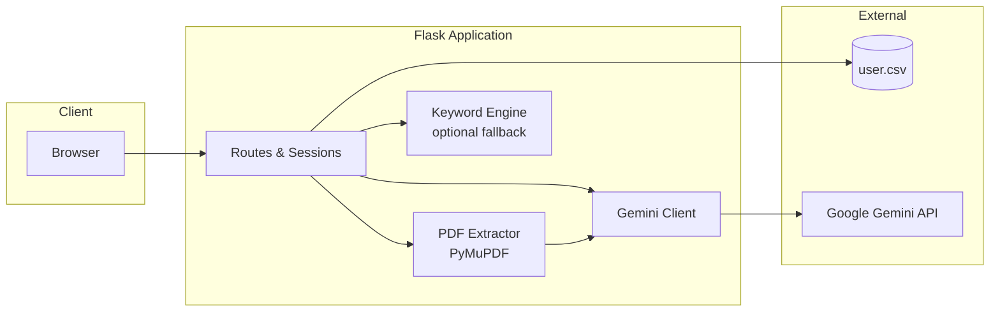

# ResumePro AI

**Intelligent resume analysis and career guidance powered by Google Gemini and Flask.**

ResumePro AI is a full-stack web application that evaluates resumes with large-language-model reasoning, returns multi-dimensional scores and actionable feedback, and offers an in-app career coach via chat. Users can paste resume text or upload a PDF; the platform extracts content, analyzes it with Gemini, and presents results in a responsive, accessible interface with optional dark mode.

---

## Table of Contents

- [Features](#features)
- [Architecture](#architecture)
- [Technology Stack](#technology-stack)
- [Prerequisites](#prerequisites)
- [Installation](#installation)
- [Configuration](#configuration)
- [Usage](#usage)
- [Scoring Model](#scoring-model)
- [API Routes](#api-routes)
- [Project Structure](#project-structure)
- [Deployment](#deployment)
- [Security Notes](#security-notes)
- [Limitations & Roadmap](#limitations--roadmap)
- [Contributing](#contributing)
- [Acknowledgments](#acknowledgments)

---

## Features

| Capability | Description |
|------------|-------------|
| **AI resume analysis** | Gemini 2.0 Flash evaluates content for overall quality, strengths, weaknesses, and tiered rating (e.g. Outstanding → Weak). |
| **Multi-category scoring** | Technical skills, experience, education, soft skills, and structure/ATS presentation—each with configurable weight in the analysis prompt. |
| **PDF & text input** | Upload PDF (PyMuPDF extraction) or paste plain text; minimum ~50 words required for meaningful analysis. |
| **Actionable suggestions** | Markdown-formatted improvement tips derived from the AI response. |
| **Career chat assistant** | Session-based chat with Gemini, scoped to resume and career topics; history capped at 20 turns. |
| **User accounts** | Registration and login with validation rules; protected routes for analyzer and chat. |
| **Admin view** | Read-only listing of registered users from `user.csv`. |
| **Modern UI** | Bootstrap 5, Inter typography, animated score visualization, drag-and-drop upload, light/dark theme with `localStorage` persistence. |
| **Resilience** | JSON parse fallback and keyword-based scoring if the Gemini API is unavailable. |
| **Performance helpers** | In-memory keyword pattern cache and analysis result cache (bounded). |

---

## Architecture



**Analysis flow**

1. Authenticated user submits resume text or a PDF (max 10 MB).
2. PDFs are saved temporarily under `uploads/`, text is extracted, then the file is deleted.
3. `analyze_resume_with_gemini()` sends structured instructions to **Gemini 2.0 Flash** and expects JSON (overall score, category scores, strengths, weaknesses, suggestions, level, summary).
4. Results are mapped into the template model and rendered on the results page; suggestions are formatted as Markdown.

A legacy keyword-matching engine (`score_section`, weighted skill categories) remains in `app.py` for fallback scoring and caching but the primary `/resume` path uses Gemini output.

---

## Technology Stack

| Layer | Technologies |
|-------|----------------|
| **Runtime** | Python 3.10+ (`runtime.txt`: 3.10.13) |
| **Backend** | Flask 3.1.1, Werkzeug, Gunicorn |
| **AI** | `google-generativeai` — Gemini 2.0 Flash |
| **PDF** | PyMuPDF (`fitz`) |
| **Frontend** | Jinja2 templates, Bootstrap 5.3, Font Awesome 6, inline CSS |
| **Config** | `python-dotenv`, `config.py` (environment profiles) |
| **Storage** | CSV file for users (`user.csv`) |

---

## Prerequisites

- **Python** 3.10 or newer  
- **Google Gemini API key** — [Google AI Studio](https://aistudio.google.com/apikey)  
- **Git** (optional, for cloning)

---

## Installation

### 1. Clone the repository

```bash
git clone https://github.com/<your-username>/Flask-Ai-ResumeScorer.git
cd Flask-Ai-ResumeScorer
```

### 2. Create and activate a virtual environment

**Windows (PowerShell)**

```powershell
python -m venv venv
.\venv\Scripts\Activate.ps1
```

**macOS / Linux**

```bash
python3 -m venv venv
source venv/bin/activate
```

### 3. Install dependencies

```bash
pip install -r requirements.txt
```

### 4. Configure environment variables

Create a `.env` file in the project root (never commit this file):

```env
SECRET_KEY=your-long-random-secret-key
GEMINI_API_KEY=your_gemini_api_key
```

Optional for production:

```env
FLASK_ENV=production
```

### 5. Initialize user storage

On first run, ensure `user.csv` exists with a header row, or let registration create rows. A typical header:

```csv
Name,Email,Password
```

### 6. Run the application

**Development**

```bash
python app.py
```

Open [http://127.0.0.1:5000](http://127.0.0.1:5000).

**Production (local)**

```bash
gunicorn app:app --bind 0.0.0.0:5000
```

---

## Configuration

| Variable | Required | Description |
|----------|----------|-------------|
| `SECRET_KEY` | Recommended | Flask session signing key. Defaults to a development placeholder if unset. |
| `GEMINI_API_KEY` | **Yes** | API key for Google Generative AI. |
| `FLASK_ENV` | No | Use `production` with HTTPS and secure cookies in live deployments. |

Application settings in code (`app.py`):

- Upload folder: `uploads/` (auto-created)
- Max upload size: **10 MB**
- Session cookies: `HttpOnly`, `SameSite=Lax`; set `SESSION_COOKIE_SECURE=True` behind HTTPS

`config.py` defines `DevelopmentConfig`, `ProductionConfig`, and `TestingConfig` for future factory-pattern integration.

---

## Usage

1. **Home** — Visit `/` for product overview and navigation.
2. **Register** — `/register` — username (3–20 letters), valid email, strong password (8+ chars, upper, lower, digit, special).
3. **Login** — `/login` — email and password.
4. **Analyze** — `/resume` — upload PDF or paste text (≥ 50 words), submit for AI analysis.
5. **Results** — View overall score, category breakdown, strengths/weaknesses, and suggestions.
6. **Chat** — `/chat` — ask resume and career questions.
7. **Logout** — `/logout` clears the session.

**Admin:** `/admin` lists users from `user.csv`.  
**Reset data:** `POST /reset` clears user records (use only in development).

---

## Scoring Model

Gemini is instructed to score across five dimensions:

| Category | Weight | Focus |
|----------|--------|--------|
| Technical skills | 35% | Tools, depth, certifications, practical use |
| Experience | 25% | Achievements, progression, impact |
| Education | 15% | Degrees, certifications, learning |
| Soft skills | 15% | Leadership, communication, teamwork |
| Structure | 10% | Format, clarity, ATS compatibility |

**Overall bands (guidance to the model)**

| Score | Label |
|-------|--------|
| 90–100 | Exceptional |
| 80–89 | Excellent |
| 70–79 | Good |
| 60–69 | Average |
| 50–59 | Below average |
| 0–49 | Poor |

If the API fails or returns non-JSON output, a **fallback analyzer** uses content length and basic keyword heuristics so the UI remains usable.

---

## API Routes

| Method | Path | Auth | Description |
|--------|------|------|-------------|
| GET | `/` | No | Landing page |
| GET, POST | `/register` | No | User registration |
| GET, POST | `/login` | No | User login |
| GET | `/logout` | No | End session |
| GET, POST | `/resume` | Yes | Resume upload / analysis |
| GET, POST | `/chat` | Yes | AI career chat |
| GET | `/admin` | No | User list (see security notes) |
| POST | `/reset` | No | Clear `user.csv` (development) |

---

## Project Structure

```
Flask-Ai-ResumeScorer/
├── app.py                 # Flask app, routes, Gemini & scoring logic
├── config.py              # Environment-based configuration classes
├── requirements.txt       # Python dependencies
├── Procfile               # Heroku: gunicorn app:app
├── runtime.txt            # Python version for PaaS
├── user.csv               # User store (created/updated at runtime)
├── uploads/               # Temporary PDF storage (auto-created)
├── .env                   # Secrets (gitignored — create locally)
├── .gitignore
└── templates/
    ├── base.html          # Layout, navbar, theme toggle
    ├── home.html          # Landing page
    ├── login.html
    ├── reg.html
    ├── results.html       # Post-registration confirmation
    ├── index.html         # Resume upload / paste
    ├── result.html        # Analysis results
    ├── chat.html          # AI chat UI
    └── admin.html         # User administration view
```

> **Note:** Styles and scripts are embedded in templates and loaded from CDNs; there is no separate `static/` directory in this repository.

---

## Deployment

### Heroku

1. Create an app and set config vars: `SECRET_KEY`, `GEMINI_API_KEY`.
2. Ensure `Procfile` and `runtime.txt` are committed.
3. Deploy:

```bash
git push heroku main
```

### Other platforms

Compatible with any WSGI host (Railway, Render, DigitalOcean App Platform, AWS Elastic Beanstalk, etc.):

- Start command: `gunicorn app:app`
- Python **3.10+**
- Set environment variables in the platform dashboard
- Enable HTTPS and set `SESSION_COOKIE_SECURE=True` in production

---

## Security Notes

This project is suitable for **learning and demos**. Before any public deployment, consider hardening:

| Topic | Current behavior | Recommendation |
|-------|------------------|----------------|
| Password storage | Plain text in `user.csv` | Hash with bcrypt/argon2; use a real database |
| Admin route | Unauthenticated `/admin` | Protect with admin role or remove |
| `/reset` | Clears all users without auth | Disable or guard in production |
| API keys | Loaded from `.env` | Never commit `.env`; rotate keys if exposed |
| Sessions | Default dev `SECRET_KEY` if unset | Always set a strong `SECRET_KEY` in production |

---

## Limitations & Roadmap

**Current limitations**

- No persistent analysis history per user  
- Single-file CSV auth is not suitable for high traffic  
- Gemini availability and quota affect analysis quality and uptime  
- PDF extraction quality depends on resume layout (scanned images need OCR)

**Possible enhancements**

- [ ] Password hashing and SQL/NoSQL user store  
- [ ] Role-based admin and audit logging  
- [ ] Save and compare past analyses  
- [ ] Job-description match scoring  
- [ ] Export results as PDF  
- [ ] REST API for third-party integrations  
- [ ] OCR for image-based PDFs  

---

## Contributing

Contributions are welcome.

1. Fork the repository  
2. Create a feature branch: `git checkout -b feature/your-feature`  
3. Commit with a clear message  
4. Push and open a Pull Request  

Please do not commit `.env`, API keys, or real user data.

---

## Acknowledgments

- [Google Gemini](https://ai.google.dev/) for generative analysis  
- [Flask](https://flask.palletsprojects.com/) and [Bootstrap](https://getbootstrap.com/) communities  
- [PyMuPDF](https://pymupdf.readthedocs.io/) for PDF text extraction  

---

<div align="center">

**ResumePro AI** — built with Flask and Gemini  

If this project helped you, consider starring the repository.

</div>

## Screenshorts


